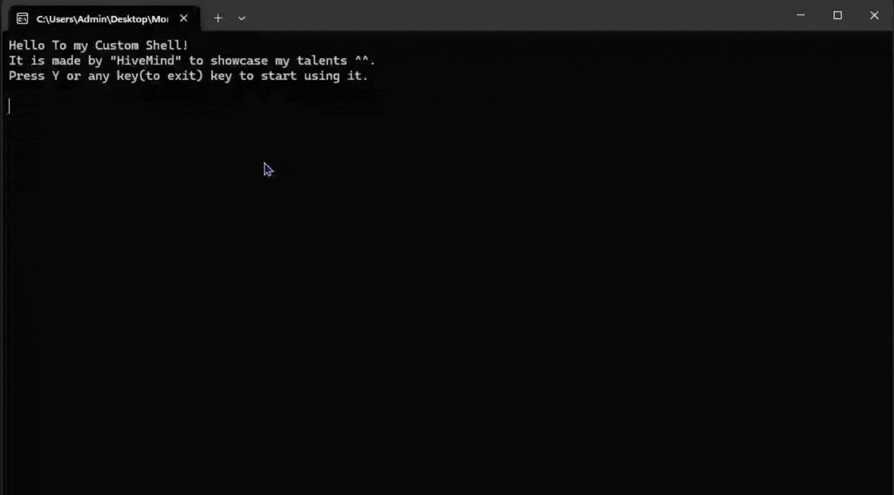

# 🦀 MommySuite: Rust-Based Systems Ecosystem

> A **complete language ecosystem** built in Rust: custom shell + transpiler + compiler + standard library.

---

## 📋 Quick Overview

**What is MommySuite?**
- 🔤 **Custom Language** - MommyLang: A playful domain-specific language
- 🐚 **Interactive Shell** - 20+ commands for file/system operations
- 🔨 **Full Compiler** - Transpiles to C, compiles with GCC
- 📚 **Standard Library** - Shared utilities for all components
- ~2650 lines of Rust, modular architecture, production-quality error handling

**The Three Components:**
```
MommySuite
├── mommy_lib (1500 lines)      → Shared language logic
├── mommy_shell (800 lines)     → Interactive terminal UI
└── mommy_lang (350 lines)      → Compiler/transpiler
```

---

## 🚀 Quick Start

```bash
# Clone and build
cargo build --release

# Run the shell
./target/release/mommy_shell.exe

# Or compile a .mommy file directly
./target/release/mommy_lang.exe path/to/program.mommy
```

**Try this in the shell:**
```
> walkwithme sandbox
> runthis palindrome.mommy
```

---

## 🤔 Why I Built This

As a student learning systems concepts, I wanted to **understand how things actually work** at a deep level—not just follow tutorials.

Building just a shell was boring. So I went all-in: created a **complete language ecosystem** combining:
- Compiler design (lexing, parsing, code generation)
- Systems programming (process spawning, file I/O, memory management)
- Software architecture (modular design, error handling)
- User experience (narrative-driven interface)

**Goal:** Become a better **Systems Programmer** through deep, hands-on learning.

---

## 📖 Table of Contents

1. [Architecture Overview](#-architecture-overview)
2. [Shell UI & Features](#-shell-ui--features)
3. [How to Use](#-how-to-use-mommyshell-commands)
4. [MommyLang Syntax Guide](#-mommylang-syntax-guide)
5. [Important Notes](#-important-notes)
6. [Development Phases](#-development-phases)
7. [Project Statistics](#-project-statistics)

---

## ⚙️ Architecture Overview

### **High-Level Design**

```
┌─────────────────────────────────────────┐
│         MommySuite Ecosystem            │
├─────────────────────────────────────────┤
│                                         │
│  mommy_lang (Compiler)                  │
│  ├─ Lexer → Parser → Code Gen → GCC     │
│  └─ Converts .mommy files to .exe       │
│                                         │
│  mommy_shell (Terminal UI)              │
│  ├─ 20+ commands (file, dir, exec)      │
│  └─ Interactive prompt with personality │
│                                         │
│  mommy_lib (Shared Library)             │
│  ├─ Language core (lexer, parser, etc)  │
│  ├─ Error handling (25+ error types)    │
│  ├─ Configuration persistence           │
│  └─ Unified UI formatting               │
│                                         │
└─────────────────────────────────────────┘
```

### **Component Details**

| Component       | Purpose                    | Key Files                                                                                                                           |
|-----------------|----------------------------|-------------------------------------------------------------------------------------------------------------------------------------|
| **mommy_lib**   | Language logic + utilities | `syntax_lexer.rs`, `declaration.rs`, `alu.rs`, `loops.rs`, `conditions.rs`, `io.rs`, `responses.rs`, `shell_format.rs`, `config.rs` |
| **mommy_shell** | User-facing terminal       | `main.rs`, `file_ops.rs`, `dir_ops.rs`, `exec_ops.rs`, `config_ops.rs`, `editor_ops.rs`, `help_ops.rs`, `windows_ops.rs`            |
| **mommy_lang**  | Compiler/transpiler        | Single `main.rs` with compilation pipeline                                                                                          |

### **Key Design Principles**

- ✅ **Modular**: Each component has one clear responsibility
- ✅ **Shared Library**: `mommy_lib` used by both shell and compiler (no duplication)
- ✅ **Narrative UI**: All output maintains consistent "mommy" personality
- ✅ **Error-Aware**: 25+ distinct error types with helpful messages
- ✅ **Persistent**: Settings saved to `mommy_conf.memory` across sessions
- ✅ **Well-Organized**: ~2650 lines across 22 focused files



---

## 🎨 Shell UI & Features

### **Unified Formatting System** (`shell_format.rs`)

All shell output uses consistent, narrative-driven formatting:

```
════════════════════════════════════════════════════════════════
  │ Content here
  │ Multiple lines supported
════════════════════════════════════════════════════════════════
```

**Functions:**
- `print_wrapper()` - Wraps messages with decorative borders
- `print_line()` - Indented output with consistent formatting
- `print_prompt()` - User prompt display (e.g., `> Harold`)
- `read_prompted_line_with_error()` - Safe user input handling

### **Data Persistence** (`mommy_conf.memory`)

Your settings are saved and persist across sessions:
- ✓ User's chosen name
- ✓ Preferred code output directory
- ✓ Shell customization preferences

---

## 🐚 How to Use: MommyShell Commands

### **Basic Navigation**

| Command            | Equivalent   | What it does                    |
|--------------------|--------------|---------------------------------|
| `tellme`           | `help`       | List all available commands     |
| `mayileave`        | `exit`       | Exit the shell                  |
| `iamhere`          | `pwd`        | Show current directory          |
| `mommy?`           | `ls` / `dir` | List files in current directory |
| `walkwithme <dir>` | `cd <dir>`   | Navigate to a directory         |
| `goback`           | `cd ..`      | Go up one directory             |

### **File Operations**

| Command           | Equivalent       | What it does             |
|-------------------|------------------|--------------------------|
| `canihave <file>` | `touch`          | Create a new file        |
| `takethe <file>`  | `rm` / `del`     | Delete a file            |
| `readthis <file>` | `cat` / `type`   | Display file contents    |
| `openthis <file>` | `start` / `open` | Open file in default app |

### **Directory Operations**

| Command                | Equivalent | What it does           |
|------------------------|------------|------------------------|
| `letusplayhouse <dir>` | `mkdir`    | Create a new directory |
| `removethehouse <dir>` | `rmdir`    | Delete a directory     |

### **System Operations**

| Command             | Equivalent | What it does               |
|---------------------|------------|----------------------------|
| `doxxme`            | `ipconfig` | Show network configuration |
| `callmeplease <ip>` | `ping`     | Ping a device/domain       |

### **Developer Tools** (Advanced)

| Command              | What it does                                            |
|----------------------|---------------------------------------------------------|
| `runthis <file>`     | Compile & execute `.mommy` file (transpile → GCC → run) |
| `startcoding`        | Open code editor for writing MommyLang scripts          |
| `changeoutput <dir>` | Set directory for compiled files                        |
| `clear`              | Clear the screen                                        |

---

## 💬 MommyLang Syntax Guide

### **1. Core Keywords**

| Keyword      | Purpose                      | Example                      |
|--------------|------------------------------|------------------------------|
| `mayihave`   | Declare variable             | `mayihave 10 in age as int`  |
| `group`      | Declare array                | `group 5 in arr as int`      |
| `replace`    | Assign value                 | `replace age with 20`        |
| `in`         | Array index/container marker | `replace arr in 0 with 42`   |
| `as`         | Type definition              | `mayihave 10 in x as int`    |
| `with`       | Value assignment             | `replace x with 15`          |
| `address`    | Get memory address (`&`)     | `replace ptr with x address` |
| `inside`     | Dereference pointer (`*`)    | `replace ptr with 5 inside`  |
| `ibegyou`    | Heap allocation              | `ibegyou 5 in var as int`    |
| `takeitback` | Free heap allocation         | `takeitback var`             |
| `punishme`   | Loop (for)                   | `punishme 10`                |
| `punishmeif` | Conditional loop (while)     | `punishmeif i < 10`          |
| `ask`        | Condition (if)               | `ask if x > 5`               |
| `or`         | Else branch                  | `or`                         |
| `satisfied`  | Break loop                   | `satisfied`                  |
| `done`       | End block (`}`)              | `done`                       |
| `say`        | Print output                 | `say hello`                  |
| `listen`     | Read input (stdin)           | `listen name upto 32`        |
| `leave`      | Exit program                 | `leave`                      |

### **2. Syntax Examples**

#### **Variables** ("The Box")
```
mayihave 10 in age as int
replace age with 20
say age
```

#### **Arrays** ("The Memory")
```
group 5 in scores as int
replace scores in 0 with 95
say scores in 0
```

#### **Pointers** ("The Finger")
```
mayihave 10 in x as int
replace ptr with x address
replace ptr with 5 inside
```

#### **Heap Memory** ("The Plea")
```
ibegyou 5 in var as int
replace var with 10 inside
say var in 0

takeitback var
```

#### **Input** ("The Ear")
```
mayihave 0 in age as int
listen age

mayihave "" in name as String
listen name upto 64
```

#### **Loops** ("The Discipline")
```
punishme 10
  say "hello"
done

punishmeif i < 10
  add i with 1
done
```

#### **Conditionals** ("The Rules")
```
ask if age > 18
  say "adult"
or
  say "minor"
done
```

#### **Arithmetic** ("The Pain")
```
mayihave 5 in x as int
add x with 3
subtract x with 1
multiply x with 2
divide x with 2
mod x with 3
```

---

## ⚠️ Important Notes

### **Disclaimer**
**This project is for EDUCATIONAL PURPOSES ONLY.**
- 🎓 Created to practice system-level concepts (Processes, Memory, Pointers)
- 🚫 Not intended for production use
- 🤪 Naming convention is a "creative constraint" for entertainment
- 🔨 Still in active development

### **Safety Warning** 💥

**This shell has REAL system access. Be careful!**

It can:
1. ❌ Delete files in the current directory (even System32)
   - **DO NOT run with admin rights**
2. Create new files and folders
3. Execute system commands (Windows/Linux)

Always double-check commands before running!

---

---

## 📈 Development Phases

### **Phase 1: Core Language (✅ COMPLETE)**
- [x] Variable declarations (int, float, char, String)
- [x] Arrays (group keyword)
- [x] Arithmetic operations (add, subtract, multiply, divide, mod)
- [x] I/O operations (say/print)
- [x] Conditionals (ask/if, or/else)
- [x] Basic loops (punishme/for, punishmeif/while)
- [x] Program control (leave/return)
- [x] Basic shell with file/directory operations

### **Phase 2: Discipline Update (🔧 IN PROGRESS)**
- [x] Modular architecture refactor
- [x] Unified shell formatting system (`shell_format.rs`)
- [x] Data persistence (`mommy_conf.memory`)
- [x] Constants module (100+ named constants)
- [x] Pointer support (`address`, `inside` keywords)
- [x] Heap allocation (`ibegyou` keyword)
- [x] Standard input (`listen` keyword)
- [ ] Package system (`please use` keyword)
- [ ] Bitwise operations
- [ ] Functions
- [ ] System Calls
- [ ] Enhanced error messages
- [ ] Security & sandboxing

### **Phase 3: Stockholm Update (📋 PLANNED)**
- [ ] Custom IDE editor (syntax highlighting, real-time editing)
- [ ] Multi-file project support
- [ ] Advanced debugging features
- [ ] Performance optimizations
- [ ] Terminal UI improvements
- [ ] Cleanup (refactoring & optimization)

### **Phase 4: OS Features (🚀 FUTURE)**
- [ ] MommyOS kernel concepts
- [ ] Process management
- [ ] Memory allocation tracking
- [ ] Custom standard library expansion

---

## 📊 Project Statistics

| Metric                          | Value      |
|---------------------------------|------------|
| **Total Lines (Rust)**          | ~2650      |
| **Core Library (mommy_lib)**    | 14 modules |
| **Shell Modules (mommy_shell)** | 8 modules  |
| **Language Keywords**           | 25+        |
| **Shell Commands**              | 20+        |
| **Error Types**                 | 25+        |
| **Example Programs**            | 8+         |

---

## 🤝 Contributing & Development

This is an **educational project** demonstrating systems programming concepts in Rust.

### **Architecture Principles**
- **Single Responsibility**: Each module handles one concern
- **Shared Library Pattern**: `mommy_lib` provides abstractions to `mommy_shell` and `mommy_lang`
- **Narrative Design**: All user-facing output maintains consistent "mommy" personality
- **Error Context**: Errors include line numbers, suggestions, and formatted messages

### **Code Organization**
```
MommySuite/
├── mommy_lib/          # Core language & utilities
│   └── src/
│       ├── syntax_lexer.rs      # Tokenization
│       ├── declaration.rs       # Variable/array/pointer management
│       ├── alu.rs               # Arithmetic operations
│       ├── io.rs                # Input/output
│       ├── loops.rs/conditions.rs # Control flow
│       ├── responses.rs         # Error & UI messages
│       ├── shell_format.rs      # Unified formatting (NEW)
│       ├── config.rs            # Settings persistence
│       └── [other modules...]
├── mommy_shell/        # User interface (Terminal)
│   └── src/
│       ├── main.rs              # CLI entry point
│       ├── file_ops.rs          # File management
│       ├── dir_ops.rs           # Directory navigation
│       ├── exec_ops.rs          # Program execution
│       └── [other modules...]
└── mommy_lang/         # Compiler/Transpiler
    └── src/
        └── main.rs              # Compilation pipeline
```

---

## 📝 License & Attribution

Created as an educational exploration of **systems programming** in Rust.
Made by "HiveMind" to showcase learning and growth as a systems programmer.

**⚠️ Not for production use.** This project is for learning purposes only.
